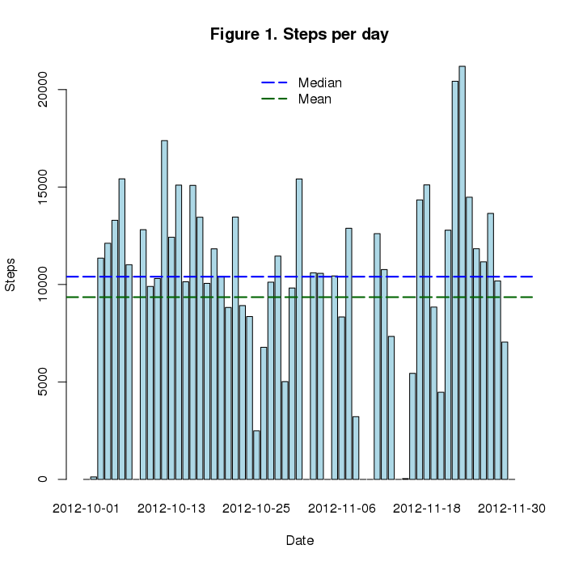
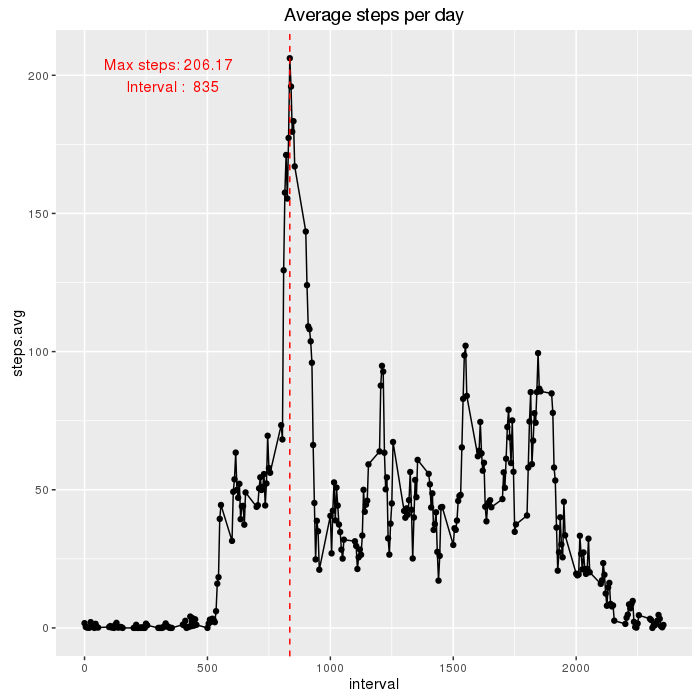

# Coursera Data Science Track
### Reproducible Research, Project 1

## Source data preparation
Data used for this study may be found [here](https://d396qusza40orc.cloudfront.net/repdata%2Fdata%2Factivity.zip). Data source was provided as part of Reproducible Research Course and was awailable at _Sunday, March 6, 2016_.
Code below, checks if CSV data availaable in work directory and loads source into _activity_ data farme. Code all necessary steps to prepare raw data.


```r
  options(scipen=1,digits=6)
  # Source data  is not available in work directory.
  if (!file.exists("activity.csv")) {
    tfile <- tempfile()
    # Check platfoerm to handle HTTPs protocol properly
     dmethod <- switch(Sys.info()["sysname"], Linux="curl", Windows="wininet")
     download.file("https://d396qusza40orc.cloudfront.net/repdata%2Fdata%2Factivity.zip",
                tfile, quiet=T,method = dmethod);
    # Exctract activity.csv                
     unzip(tfile,overwrite = T)
    # cleanup preparation 
     unlink(tfile)
     rm(tfile,dmethod)
  }
  # Load Soruce data.
  
  activity<-read.csv("activity.csv")
```

Data set contans 3 variables, where variable date is a factor of characters.

```r
 str(activity)
```

```
## 'data.frame':	17568 obs. of  3 variables:
##  $ steps   : int  NA NA NA NA NA NA NA NA NA NA ...
##  $ date    : Factor w/ 61 levels "2012-10-01","2012-10-02",..: 1 1 1 1 1 1 1 1 1 1 ...
##  $ interval: int  0 5 10 15 20 25 30 35 40 45 ...
```

I've converted varaibe date to POSIXct format to enable proper timelaine analysis.

```r
 activity$date <- as.POSIXct(as.character(activity$date),"%Y-%m-%d")
```
## Eaxmine tidy data 

Compute daily activity using [dplyr](https://cran.rstudio.com/web/packages/dplyr/vignettes/introduction.html) library

```r
  require(dplyr)
  stepsbyday <- group_by(activity, date) %>% 
    summarize(steps=sum(steps,na.rm= TRUE))
```

Daily recorded activity with indicated mean and median levels.

```r
  with(stepsbyday,
       barplot(steps,col = "lightblue",
                names.arg = date, main="Figure 1. Steps per day", xlab = "Date",ylab="Steps")
       )
  abline(h=summary(stepsbyday$steps)["Mean"], col="darkgreen",lwd=2,lt=5)
  abline(h=summary(stepsbyday$steps)["Median"], col="blue",lwd=2,lt=5)
  legend(x="top", y="center",legend=c("Median","Mean"), col=c("blue","darkgreen"),bty="n",lwd=2,lty=5)
```




Dayly based statistics gives us __9350__ as average amount of steps  with median equal to  __10400__. Othere summary facts are below:

```r
summary(stepsbyday$steps)
```

```
##    Min. 1st Qu.  Median    Mean 3rd Qu.    Max. 
##       0    6780   10400    9350   12800   21200
```

```r
  require(ggplot2)
  # Calculate means by day interval, ignore NAs
  stepsbyint<-group_by(activity,interval) %>% summarize(steps.avg=mean(steps,na.rm=T))
  # Maximum activity interval
  maxint<-as.number(stepsbyint[stepsbyint$steps.avg == max(stepsbyint$steps.avg),"interval"]) 
```

```
## Error in eval(expr, envir, enclos): could not find function "as.number"
```

```r
  gint<-qplot(data=stepsbyint,x=interval,y=steps.avg,main = "Average steps per day")+
  geom_line()+geom_vline(aes(xintercept=maxint),col="red",lty=2)+
    annotate("text",x = 350,y= 200, 
             label=paste("Max steps:",round(max(stepsbyint$steps.avg),2),"\n",
                     "Interval : ",maxint),col="red")
  print(gint)
```


Line plot allows us identify intervals with maximum activity during day. For our data maximum activity recorded for interval __835__ with average steps __206.17__. In other ways aximum activity was registerd for time between 1PM and 2PM. 

## Impute missing mesurements

As you may see on fig 1. there are multiple days has no data present. Table below list all dates with no measurements recorded. 

```r
  kable(group_by(activity,date) %>% filter(is.na(steps)) %>% summarize(missed=sum(is.na(steps))))
```


|date       | missed|
|:----------|------:|
|2012-10-01 |    288|
|2012-10-08 |    288|
|2012-11-01 |    288|
|2012-11-04 |    288|
|2012-11-09 |    288|
|2012-11-10 |    288|
|2012-11-14 |    288|
|2012-11-30 |    288|
Detailed examine show that we have __2304__ records or __13.11%__ from overall 5 minutes inerval measurments.

