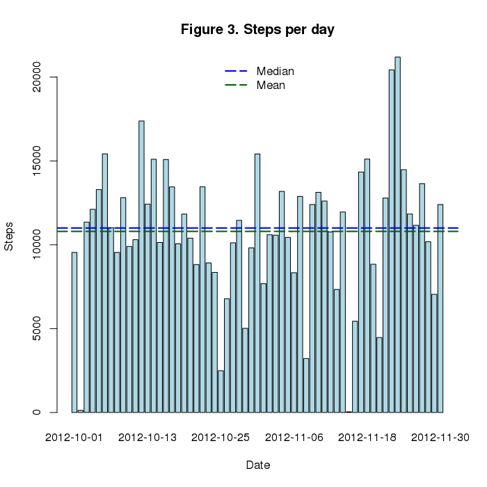
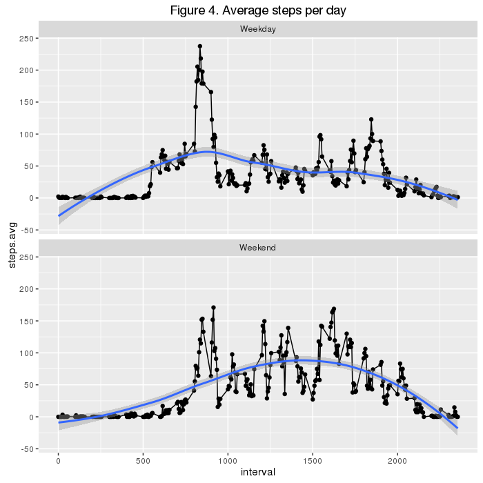

# Coursera Data Science Track
### Reproducible Research, Project 1

## Source data preparation
Data used for this study may be found [here](https://d396qusza40orc.cloudfront.net/repdata%2Fdata%2Factivity.zip). Data source was provided as part of Reproducible Research Course and was awailable at _Sunday, March 6, 2016_.
Code below, checks if CSV data availaable in work directory and loads source into _activity_ data farme. Code all necessary steps to prepare raw data.


```r
  options(scipen=1,digits=6)
  # Source data  is not available in work directory.
  if (!file.exists("activity.csv")) {
    tfile <- tempfile()
    # Check platfoerm to handle HTTPs protocol properly
     dmethod <- switch(Sys.info()["sysname"], Linux="curl", Windows="wininet")
     download.file("https://d396qusza40orc.cloudfront.net/repdata%2Fdata%2Factivity.zip",
                tfile, quiet=T,method = dmethod);
    # Exctract activity.csv                
     unzip(tfile,overwrite = T)
    # cleanup preparation 
     unlink(tfile)
     rm(tfile,dmethod)
  }
  # Load Soruce data.
  
  activity<-read.csv("activity.csv")
```

Data set contans 3 variables, where variable date is a factor of characters.

```r
 str(activity)
```

```
## 'data.frame':	17568 obs. of  3 variables:
##  $ steps   : int  NA NA NA NA NA NA NA NA NA NA ...
##  $ date    : Factor w/ 61 levels "2012-10-01","2012-10-02",..: 1 1 1 1 1 1 1 1 1 1 ...
##  $ interval: int  0 5 10 15 20 25 30 35 40 45 ...
```

I've converted varaibe date to POSIXct format to enable proper timelaine analysis.

```r
 activity$date <- as.POSIXct(as.character(activity$date),"%Y-%m-%d")
```
## Eaxmine tidy data 

Compute daily activity using [dplyr](https://cran.rstudio.com/web/packages/dplyr/vignettes/introduction.html) library

```r
  require(dplyr)
  stepsbyday <- group_by(activity, date) %>% 
    summarize(steps=sum(steps,na.rm= TRUE))
```

Daily recorded activity with indicated mean and median levels.

```r
  with(stepsbyday,
       barplot(steps,col = "lightblue",
                names.arg = date, main="Figure 1. Steps per day", xlab = "Date",ylab="Steps")
       )
  abline(h=summary(stepsbyday$steps)["Mean"], col="darkgreen",lwd=2,lt=5)
  abline(h=summary(stepsbyday$steps)["Median"], col="blue",lwd=2,lt=5)
  legend(x="top", y="center",legend=c("Median","Mean"), col=c("blue","darkgreen"),bty="n",lwd=2,lty=5)
```


Dayly based statistics gives us __9350__ as average amount of steps  with median equal to  __10400__. Othere summary facts are below:

```r
summary(stepsbyday$steps)
```

```
##    Min. 1st Qu.  Median    Mean 3rd Qu.    Max. 
##       0    6780   10400    9350   12800   21200
```


```r
  require(ggplot2)
  # Calculate means by day interval, ignore NAs
  stepsbyint<-group_by(activity,interval) %>% summarize(steps.avg=mean(steps,na.rm=T))
  # Maximum activity interval
  maxint<<-as.integer(stepsbyint[stepsbyint$steps.avg == max(stepsbyint$steps.avg),"interval"]) 
  gint<-qplot(data=stepsbyint,x=interval,y=steps.avg,main = "Figure 2. Average steps per day")+
  geom_line()+geom_vline(aes(xintercept=maxint),col="red",lty=2)+
    annotate("text",x = 350,y= 200, 
             label=paste("Max steps:",round(max(stepsbyint$steps.avg),2),"\n",
                     "Interval : ",maxint),col="red")
  print(gint)
```


Line plot allows us identify intervals with maximum activity during day. For our data maximum activity recorded for interval __835__ with average steps __206.17__. In other ways aximum activity was registerd for time between 1PM and 2PM. 

## Impute missing mesurements

As you may see on Figure 1. there are multiple days has no data present. Table below list all dates with no measurements recorded. 

```r
  kable(group_by(activity,date) %>% filter(is.na(steps)) %>% summarize(missed=sum(is.na(steps))))
```


|date       | missed|
|:----------|------:|
|2012-10-01 |    288|
|2012-10-08 |    288|
|2012-11-01 |    288|
|2012-11-04 |    288|
|2012-11-09 |    288|
|2012-11-10 |    288|
|2012-11-14 |    288|
|2012-11-30 |    288|
Detailed examine show that we have __2304__ records or __13.11%__ from overall 5 minutes inerval measurments.
To fill gaps we may use rounded avergae steps for interval in the same month. The make better assumption we will use data for the same day of week. Let's implement our impute strategy with some calculations.

1. Copy source dataset into new one with new day of week column.
  
  ```r
    iactv<-cbind(activity,dow=weekdays(activity$date))
  ```
2. As part of data preparation separate weekdays from weekends.
  
  ```r
    iactv$weekpart <- sapply(iactv$dow,FUN = function(x){
                                                switch(as.character(x),
                                                       Sunday="Weekend",
                                                       Saturday="Weekend",
                                                       "Weekday")})
  ```
3. Compute means for interval, month, and day of week combination.
  
  ```r
   avglkp<-group_by(iactv,interval,mname=months(date),dow) %>% 
                filter(!is.na(steps)) %>%
                summarize(steps.mean=round(mean(steps,na.rm=T)))
  ```
5. Helper function to lookup steps in average objects 
  
  ```r
  impute<-function(x) { 
    if (is.na(x$steps)) {
     as.integer(avglkp[avglkp$mname == months(x$date) & 
                               avglkp$interval == x$interval & 
                               avglkp$dow == x$dow,"steps.mean"])
    } 
   else {
     as.integer(x$steps)
   }
   }
  ```
6. Populate missing measurments with average values.
  
  ```r
    for (i in 1:nrow(iactv)) { iactv[i,"steps"]<-impute(iactv[i,])}
  ```
Now we are ready to  calculate corrected averages

```r
  stepsbyday2 <- group_by(iactv, date) %>% 
    summarize(steps=sum(steps))
```

Daily recorded activity with indicated mean and median levels.

```r
  with(stepsbyday2,
       barplot(steps,col = "lightblue",
                names.arg = date, main="Figure 3. Steps per day", xlab = "Date",ylab="Steps")
       )
  abline(h=summary(stepsbyday2$steps)["Mean"], col="darkgreen",lwd=2,lt=5)
  abline(h=summary(stepsbyday2$steps)["Median"], col="blue",lwd=2,lt=5)
  legend(x="top", y="center",legend=c("Median","Mean"), col=c("blue","darkgreen"),bty="n",lwd=2,lty=5)
```


The main difference that mean and median values are closer than it was for Figure 1. New statisitcs for average steps are below:

```r
   summary(stepsbyday2$steps)
```

```
##    Min. 1st Qu.  Median    Mean 3rd Qu.    Max. 
##      41    8920   11000   10800   13100   21200
```
Now let see if activity patterens are different for weekend and weekdays.
Calculate new average for 5 minute intervals and additional variable.

```r
    # Calculate means by day interval and weekdays
  stepsbyint2<-group_by(iactv,interval,weekpart) %>% summarize(steps.avg=mean(steps))
```
And create a plot to compare.


```r
  gint2<-qplot(data=stepsbyint2,x=interval,y=steps.avg,main = "Figure 4. Average steps per day")+
  geom_line()+facet_wrap(~ weekpart,nrow = 2)+geom_smooth()
  print(gint2)
```



## Summary
 Exploration on provided dataset gives us some obvious results. Pike of average daily activity was measured duirng lunch time from 1 to 2 PM daily. However weekend activity differs from work days quite noticable.
- Stapes counter starts increase later than during workdays
- Maximum values are less, but average activity is higher 
